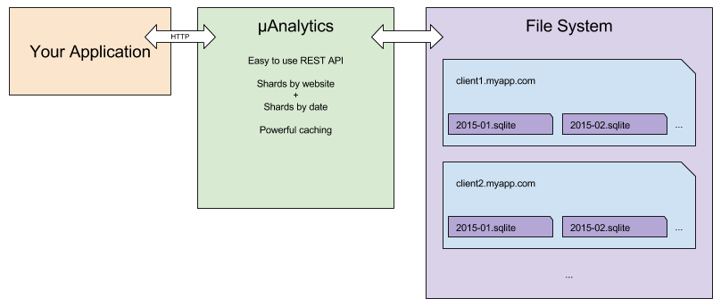

# µAnalytics

A micro multi-website analytics database service designed to be fast and robust, built with Go and SQLite.



## Principle

Analytics databases tend to grow fast and exponentially.
Requesting data for one specific website from a single database thus become very slow over time.
But analytics data are highly decoupled between two websites.

The idea behind **µAnalytics** is to shard your analytics data on a key, which is usually a website name.
Each shard thus only contains a specific website data, allowing faster response times and easy horizontal scaling.

To handle requests even faster, **µAnalytics** automatically manages a pool of connections to multiple shards at a time.

By default, the service keeps 10 connections alive.
But you can easily increase/decrease the max number of alive shards with the `--connections` flag when launching the app.


## Install

```Shell
$ go install github.com/GitbookIO/micro-analytics
```


## Service launching

To launch the application, simply run:
```
$ ./micro-analytics
```

The command takes the following optional parameters:

Parameter | Environment Variable | Usage | Type | Default Value
---- | ---- | ---- | ---- | ----
`--user, -u` | `MA_USER` | Username for basic auth | String | `""`
`--password, -w` | `MA_PASSWORD` | Password for basic auth | String | `""`
`--port, -p` | `MA_PORT` | Port to listen on | String | `"7070"`
`--root, -r` | `MA_ROOT` | Database directory | String | `"./dbs"`
`--connections, -c` | `MA_POOL_SIZE` | Max number of alive shards connections | Number | `10`
`--cache-directory, -d` | `MA_CACHE_DIR` | Cache directory | String | `".diskache"`

If `--user` is provided, the service will automatically use [basic access authentication](https://en.wikipedia.org/wiki/Basic_access_authentication) on all requests.

The cache directory is always placed in the root directory and is suffixed with app major version. The default will then be `./dbs/.diskache0`.

## Analytics schema

All shards of the **µAnalytics** database share the same TABLE schema:
```SQL
CREATE TABLE visits (
    time            INTEGER,
    event           TEXT,
    path            TEXT,
    ip              TEXT,
    platform        TEXT,
    refererDomain   TEXT,
    countryCode     TEXT
)
```


## Service requests

### GET requests

##### Common Parameters

Every query for a specific website can be executed using a time range.
Every following GET request thus takes the two following optional query string parameters:

Name | Type | Description | Default | Example
---- | ---- | ---- | ---- | ----
`start` | Date | Start date to query a range | none | `"2015-11-20T12:00:00.000Z"`
`end` | Date | End date to query a range | none | `"2015-11-21T12:00:00.000Z"`

The dates can be passed either as:
 - ISO (RFC3339) `"2015-11-20T12:00:00.000Z"`
 - UTC (RFC1123) `"Fri, 20 Nov 2015 12:00:00 GMT"`

##### Common Aggregation Parameters

Name | Type | Description | Default | Example
---- | ---- | ---- | ---- | ----
`unique` | Boolean | Include the total number of unique visitors in response | none | `true`

##### Common Aggregation Response Values

Except for `GET /:website`, every response to a GET request will contain the two following values:

Name | Type | Description
---- | ---- | ----
`total` | Integer | Total number of visits
`unique` | Integer | Total number of unique visitors based on `ip`, set to `0` unless `unique=true` is passed as a query string parameter

#### GET `/:website`

Returns the full analytics for a website.

##### Response

```JavaScript
{
    "list": [
        {
            "time": "2015-11-25T16:00:00+01:00",
            "event": "download",
            "path": "/somewhere",
            "ip": "127.0.0.1",
            "platform": "Windows",
            "refererDomain": "gitbook.com",
            "countryCode": "fr"
        },
    ...
    ]
}
```

#### GET `/:website/count`

Returns the count of analytics for a website. The `unique` query string parameter is not necessary for this request.

##### Response

```JavaScript
{
    "total": 1000,
    "unique": 900
}
```

#### GET `/:website/countries`

Returns the number of visits per `countryCode`.

##### Response

`label` contains the country full name.

```JavaScript
{
    "list": [
        {
            "id": "fr",
            "label": "France",
            "total": 1000,
            "unique": 900
        },
        ...
    ]
}
```

#### GET `/:website/platforms`

Returns the number of visits per `platform`.

##### Response

```JavaScript
{
    "list": [
        {
            "id": "Linux",
            "label": "Linux",
            "total": 1000,
            "unique": 900
        },
        ...
    ]
}
```

#### GET `/:website/domains`

Returns the number of visits per `refererDomain`.

##### Response

```JavaScript
{
    "list": [
        {
            "id": "gitbook.com",
            "label": "gitbook.com",
            "total": 1000,
            "unique": 900
        },
        ...
    ]
}
```

#### GET `/:website/events`

Returns the number of visits per `event`.

##### Response

```JavaScript
{
    "list": [
        {
            "id": "download",
            "label": "download",
            "total": 1000,
            "unique": 900
        },
        ...
    ]
}
```

#### GET `/:website/time`

Returns the number of visits as a time serie. The interval in seconds can be specified as an optional query string parameter. Its default value is `86400`, equivalent to one day.

##### Parameters

Name | Type | Description | Default | Example
---- | ---- | ---- | ---- | ----
`interval` | Integer | Interval of the time serie | `86400` (1 day) | `3600`

##### Response

Example with interval set to `3600`:

```JavaScript
{
    "list": [
        {
            "start": "2015-11-24T12:00:00.000Z",
            "end": "2015-11-24T13:00:00.000Z",
            "total": 450,
            "unique": 390
        },
        {
            "start": "2015-11-24T13:00:00.000Z",
            "end": "2015-11-24T14:00:00.000Z",
            "total": 550,
            "unique": 510
        },
        ...
    ]
}
```

### POST requests

#### POST `/:website`

Insert new data for the specified website.

##### POST Body

```JavaScript
{
    "time": "2015-11-24T13:00:00.000Z", // optional
    "event": "download",
    "ip": "127.0.0.1",
    "path": "/README.md",
    "headers": {
        ...
        // HTTP headers received from your visitor
    }
}
```

The `time` parameter is optional and is set to the date of your POST request by default.

Passing the HTTP headers in the POST body allows the service to extract the `refererDomain` and `platform` values.
The `countryCode` will be deduced from the passed `ip` parameter using [Maxmind's GeoLite2 database](http://dev.maxmind.com/geoip/geoip2/geolite2/).

#### POST `/:website/bulk`

Insert a list of analytics for a specific website. The analytics must be in DB format.

##### POST Body

```JavaScript
{
    "list": [
        {
            "time": 1450098642,
            "ip": "127.0.0.1",
            "event": "download",
            "path": "/somewhere",
            "platform": "Apple Mac",
            "refererDomain": "www.gitbook.com",
            "countryCode": "fr"
        },
        {
            "time": 0,
            "ip": "127.0.0.1",
            "event": "login",
            "path": "/someplace",
            "platform": "Linux",
            "refererDomain": "www.gitbook.com",
            "countryCode": "us"
        }
    ]
}
```

The passed `time` value must be a Unix timestamp in seconds. The `countryCode` will be reprocessed by the service using GeoLite2 based on the `ip`.

#### POST `/bulk`

Insert a list of analytics for different websites. The analytics must be in DB format.

##### POST Body

```JavaScript
{
    "list": [
        {
            "website": "website-1",
            "time": 1450098642,
            "ip": "127.0.0.1",
            "event": "download",
            "path": "/somewhere",
            "platform": "Apple Mac",
            "refererDomain": "www.gitbook.com",
            "countryCode": "fr"
        },
        {
            "website": "website-2",
            "time": 0,
            "ip": "127.0.0.1",
            "event": "login",
            "path": "/someplace",
            "platform": "Linux",
            "refererDomain": "www.gitbook.com",
            "countryCode": "us"
        }
    ]
}
```

The same rules as above apply for `time` and `countryCode` with this m

### DELETE requests

#### DELETE `/:website`

Fully delete a shard from the file system.

